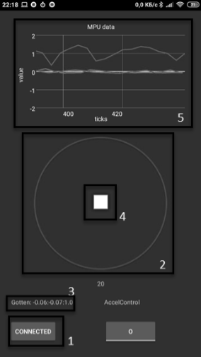

# Sample Remote Control App for Android
## Minimalist application for sending move control data and receiving acceleration info using bluetooth protocol.


Interface | Elementes
:-------------------------:|:-------------------------:
 | 1. Connect Button <br>2. Move control area <br>3. Connection Status string <br>4. Touch pointer <br> 5. MPU Acceleration data


## Data Format
```c
typedef struct 
{
    int8_t x;
    int8_t y;
    char cmd;
    char optional_cmd;
}
```
__________
### Target Bluetooth device is hardcoded in *MainActivity.java*